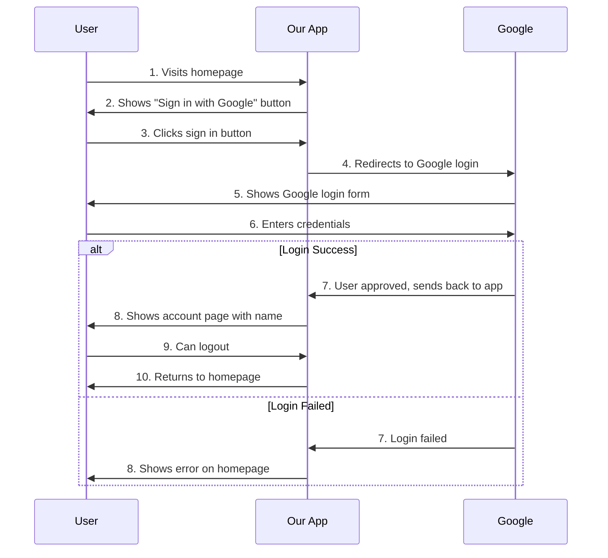
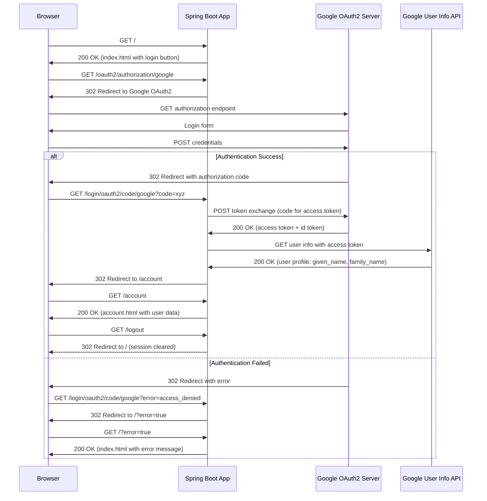
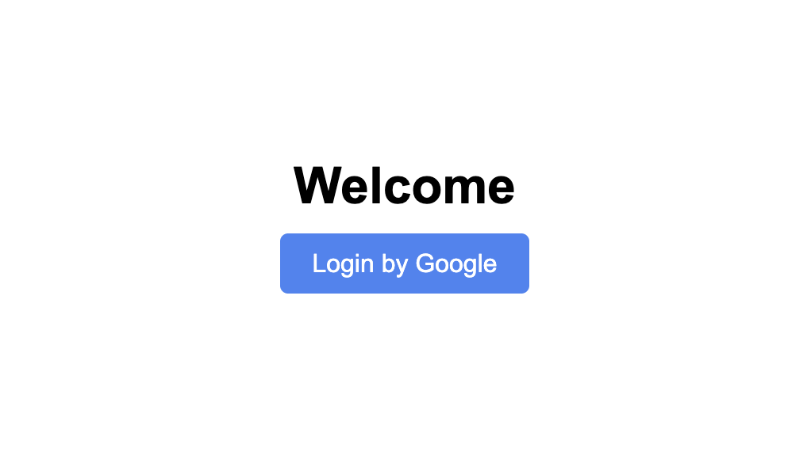
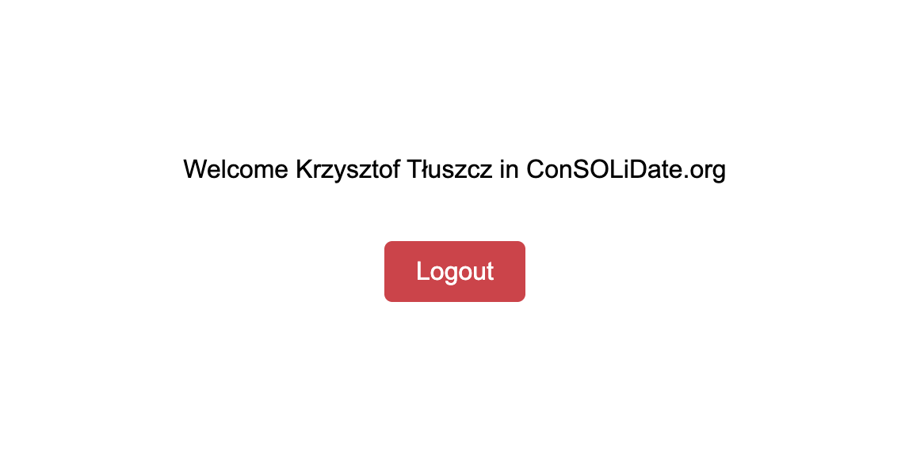
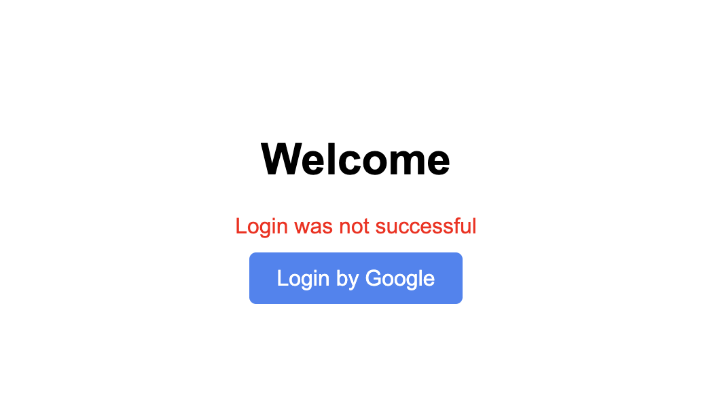

# Google OAuth2 Spring Boot Application

A minimal Spring Boot application demonstrating Google OAuth2 integration.

## Features

- Welcome page with Google sign-in button
- OAuth2 authentication with Google
- User account page displaying name and surname
- Logout functionality

## Prerequisites

- Java 17 or later
- Maven 3.6 or later

## Setup

1. **Create Google OAuth2 Credentials**
   - Go to [Google Cloud Console](https://console.cloud.google.com/)
   - Create a new project or select existing one
   - Enable Google+ API
   - Create OAuth 2.0 credentials
   - Set authorized JavaScript origin to: `http://localhost:8080`
   - Set authorized redirect URI to: `http://localhost:8080/login/oauth2/code/google`

2. **Set Environment Variables**
   ```bash
   export GOOGLE_CLIENT_ID=your_google_client_id_here
   export GOOGLE_CLIENT_SECRET=your_google_client_secret_here
   ```

3. **Run the Application**
   ```bash
   mvn spring-boot:run
   ```

4. **Access the Application**
   - Open your browser and go to `http://localhost:8080`
   - Click "Sign in with Google"
   - After successful authentication, you'll be redirected to the account page
   - After unsuccessful authentication, you'll be redirected to home page with error message

## Application Endpoints

- `/` - Home page with Google sign-in button
- `/account` - User account page (requires authentication)
- `/logout` - Logout endpoint

## For Product Owners (Non-Technical)



## For Developers (Technical)



## Application Screenshots

### Welcome Page


### Account Page


### Error State
