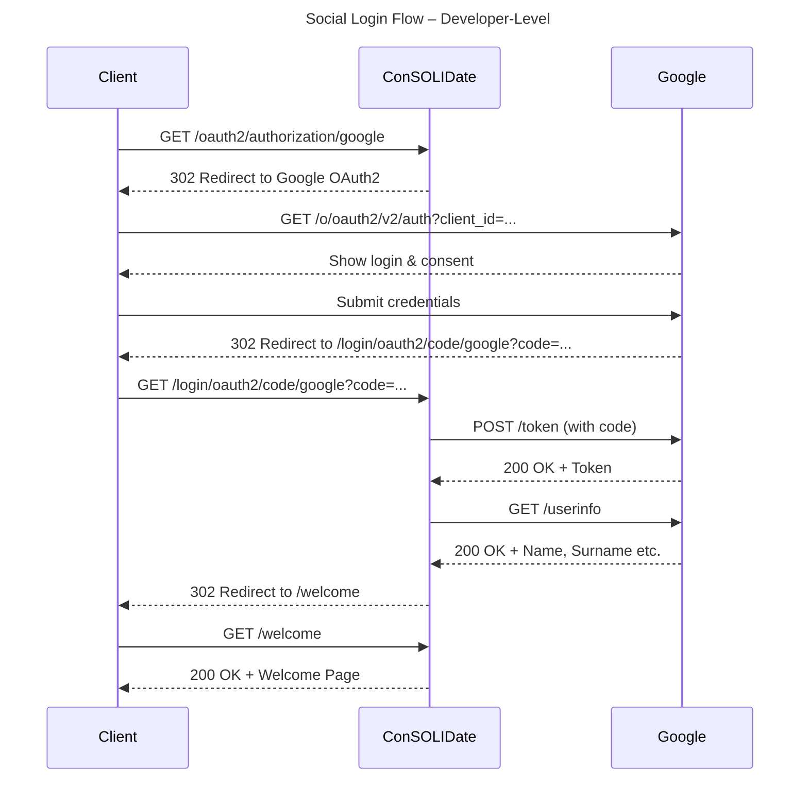
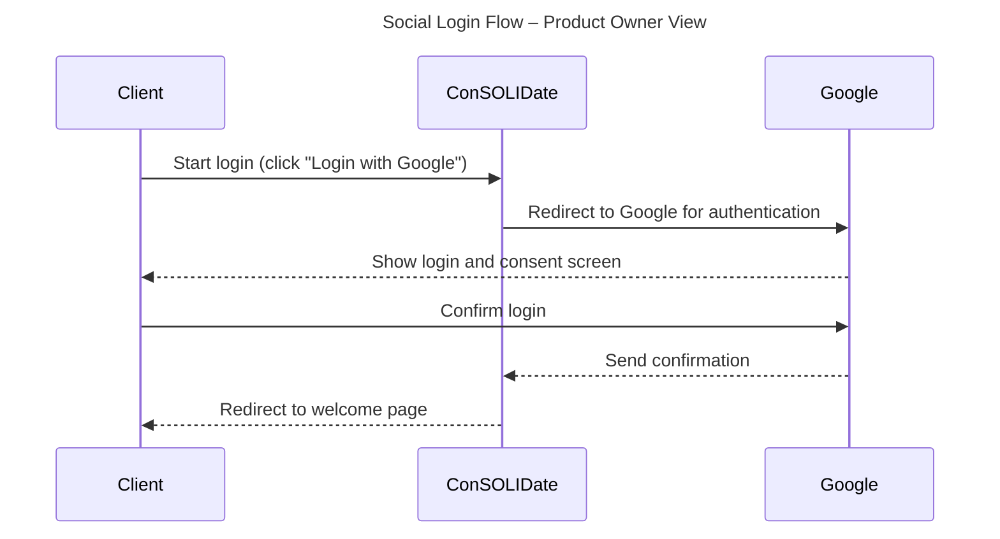
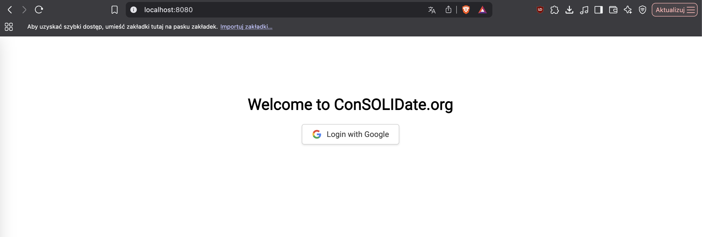
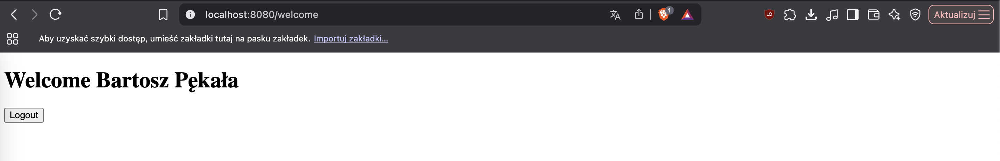

# google-task

## Social Login Flow

### Developer-Level Diagram

```mermaid
sequenceDiagram
    title Social Login Flow – Developer-Level

    participant Client
    participant ConSOLIDate
    participant Google

    Client->>ConSOLIDate: GET /oauth2/authorization/google
    ConSOLIDate-->>Client: 302 Redirect to Google OAuth2

    Client->>Google: GET /o/oauth2/v2/auth?client_id=...

    Google-->>Client: Show login & consent
    Client->>Google: Submit credentials

    Google-->>Client: 302 Redirect to /login/oauth2/code/google?code=...

    Client->>ConSOLIDate: GET /login/oauth2/code/google?code=...

    ConSOLIDate->>Google: POST /token (with code)
    Google-->>ConSOLIDate: 200 OK + Token

    ConSOLIDate->>Google: GET /userinfo
    Google-->>ConSOLIDate: 200 OK + Name, Surname etc.

    ConSOLIDate-->>Client: 302 Redirect to /welcome

    Client->>ConSOLIDate: GET /welcome
    ConSOLIDate-->>Client: 200 OK + Welcome Page
```

### Product Owner-Level Diagram

```mermaid
sequenceDiagram
    title Social Login Flow – Product Owner View

    participant Client
    participant ConSOLIDate
    participant Google

    Client->>ConSOLIDate: Start login (click "Login with Google")
    ConSOLIDate->>Google: Redirect to Google for authentication
    Google-->>Client: Show login and consent screen
    Client->>Google: Confirm login
    Google-->>ConSOLIDate: Send confirmation
    ConSOLIDate-->>Client: Redirect to welcome page
```

## Login Page

## Welcome Page

